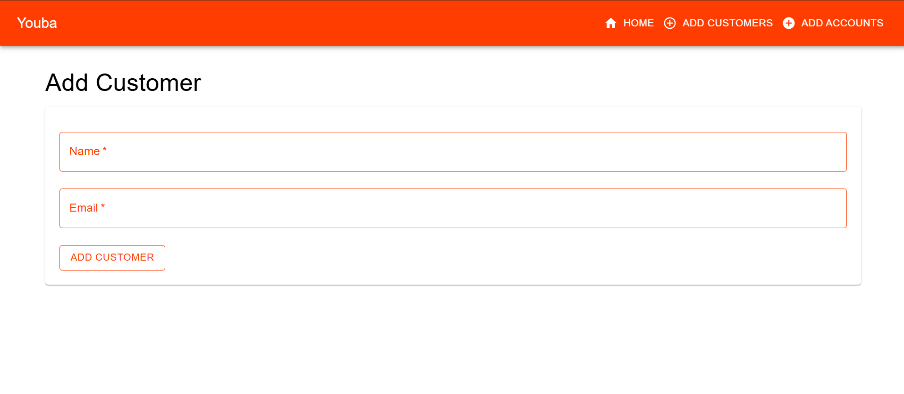

Youba Project
=============

This is a microservices-based application built with Spring Cloud and React. The project consists of multiple services that work together to provide a complete application.

Architecture
------------

The application is composed of the following services:

*   **Config Service**: Central configuration server

*   **Discovery Service**: Service registry using Netflix Eureka

*   **Gateway Service**: API Gateway using Spring Cloud Gateway

*   **Account Service**: Handles user account management

*   **Customer Service**: Manages customer information


## Application Interface

### Service Discovery Dashboard

- Monitor all registered services through Eureka Dashboard
- View service health status and metadata


### Home Page
- View list of all customers with their details
- View list of all accounts with their details


### Customer Management

- Add new customers through an intuitive form



### Account Operations

- Create new accounts for customers
- View account details and balances


### API Gateway

- Centralized routing through Spring Cloud Gateway
- Monitor request/response flow
- View gateway routes and predicates

### Configuration Management

- View and manage centralized configurations
- Monitor property changes across services
- Environment-specific configurations


Prerequisites
-------------

*   Java 17

*   Node.js

*   Maven

*   npm


Project Structure
-----------------

*   frontend: React frontend application

*   services: Backend microservices

    *   account-service/

    *   config-service/

    *   customer-service/

    *   discovery-service/

    *   gateway-service/


Getting Started
---------------

### Backend Services

1.  Start the Config Service first:

```bash
cd services/config-service./mvnw spring-boot:run
```

2. Start the Discovery Service:

```bash
cd services/discovery-service./mvnw spring-boot:run
```

3. Start the Gateway Service:

```bash
cd services/gateway-service./mvnw spring-boot:run 
```

4. Start other services (account, customer):

```bash
cd services/./mvnw spring-boot:run
```

### Frontend Application

1.  Install dependencies:

```bash
cd frontend
npm install
```

2. Start the development server:

```bash
npm start
```

3. Visit `http://localhost:3000` to view the application.


Technology Stack
----------------

### Backend

*   Spring Boot 3.4

*   Spring Cloud

*   Spring Data JPA

*   Spring Cloud Config

*   Spring Cloud Netflix Eureka

*   Spring Cloud Gateway


### Frontend

*   React

*   TypeScript

*   npm


Development
-----------

The project uses Maven wrapper for backend services and npm for frontend development.

Each service can be built individually using:

```bash
./mvnw clean install
```

## Planning

Jira is used for planning and tracking the progress of this project. You can view Jira board [here](https://meskinemsoatafa.atlassian.net/jira/software/projects/YB/boards/54/backlog).

## Contact

For any questions or feedback, please contact The author of this project:

- **Meskine Mostafa**
    - Email: meskinemostafa4@gmail.com
    - GitHub: [Meskine Mostafa](https://github.com/MesVortex).
